# Jarkom-Modul-2-D26-2023

* Fathan Abi Karami (5025211156)
* Alya Putri Salma (5025211174)

## Topologi

## Pembagian Subnet

## VLSM (Cisco Packet Tracer)
## Subnetting
Pertama Hitung jumlah Host pada tiap subnet dan rute nya. kemudian tentukan juga netmasknya pada tiap subnet

Dapat dilihat total Hostnya ada 4257, sehingga netmask subnet besar yang akan digunakan adalah /19 (255.255.224.0).

Setelah itu buat subnetting tree menggunakan metode VLSM

Setelah cari NID, Netmask, dan Broadcast Address tiap Subnet

Kemudian Implementasikan pada Cisco Packet Tracer

## Implementasi pada CPT
## Topologi:

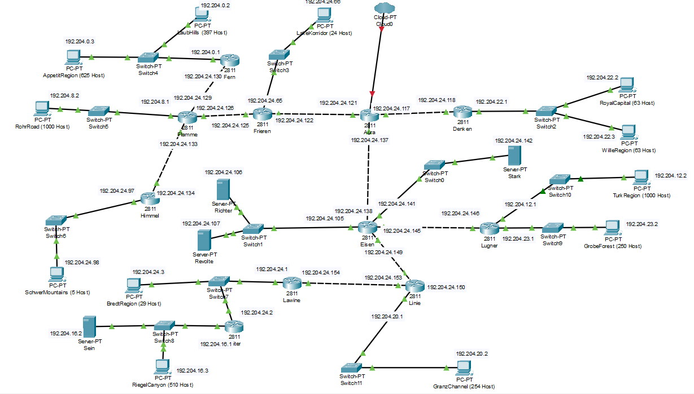

## Routing:

### Aura:

### Denken:

### Frieren:

### Flamme:

### Fern:

### Himmel:

### Eisen:

### Lugner:

### Linie:

### Lawine:

### Heiter:

## Testing
### A3 (RoyalCapital & WilleRegion)
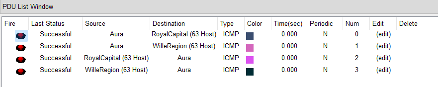

### A5 (LakeKorridor)
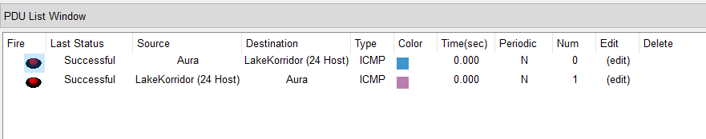

### A8 (LaubHills & AppettitRegion)
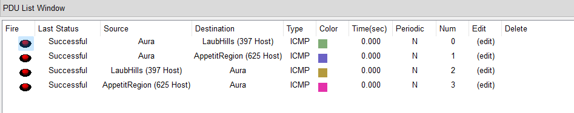

### A9 (RohrRoad)
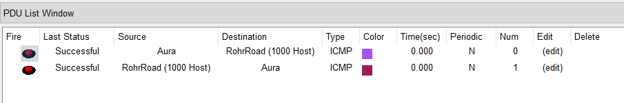

### A11 (SchwerMountains)
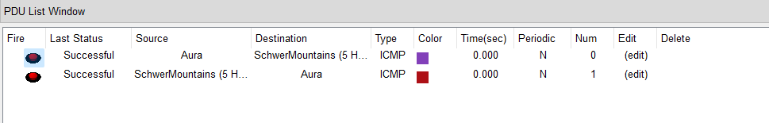

### A13 (Stark)
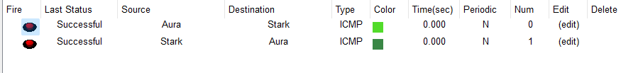

### A15 (TurkRegion)
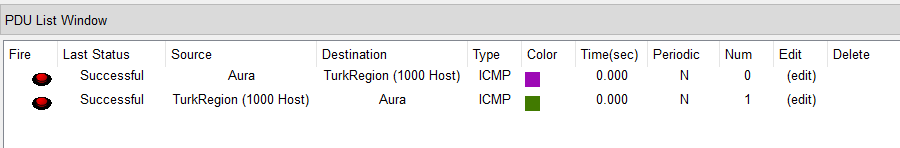

### A16 (GrobeForest)
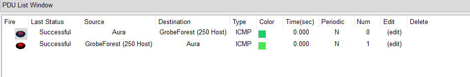

### A18 (GranzChannel)
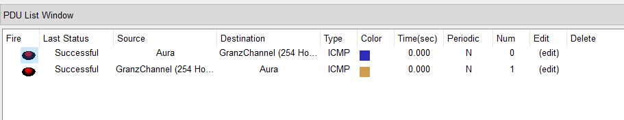

### A20 (BredtRegion & Heiter)
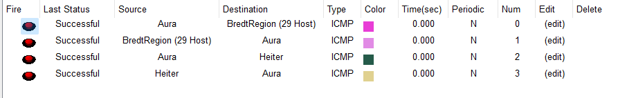

### A21 (Sein & RiegelCanyon)
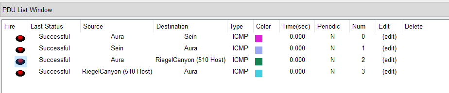

### A22 (Richter & Revolte)
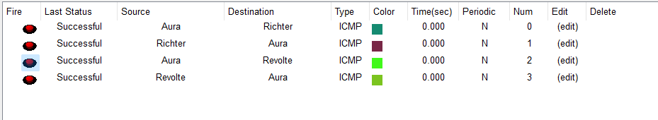

## CIDR (GNS3)

## Revisi
Terdapat revisi yaitu jumlah ip yang harusnya 4255. bukannya 4257, hal ini disebabkan kelompok kami menghitung subnet Aura-Cloud0, seperti pada template, sehingga kelebihan 2 IP.

Revisi juga terdapat saat tes routing dimana tes routing Fern-linie dan SchwerMountains-Lugner mengalami kegagalan. Hasik revisinya adalah menambah ruting.

